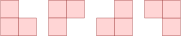
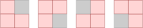

.. TNSI

Les triominos
=============

Un triomino est un assemblage de 3 carrés en forme de "L" comme le montre la figure ci-dessous.

   Les différents triominos de 3 carrés

Une grille de côté 2 carrés dont on enlève n'importe quel carré peut être recouvert par un des 4 triominos représentés ci-dessus.

   Une grille recouverte par un triomino

Algorithme de résolution
------------------------

#. Est-il possible de recouvrir la grille de côté 4 carrés par plusieurs triominos sachant qu'on enlève le carré en gris situé en haut à gauche de la grille.

   .. figure:: ../img/grille_4x4.svg
      :align: center
      :width: 160

      Une grille à recouvrir de triominos

#. Est-il possible de recouvrir de triominos une telle grille quelle que soit la position du carré gris dans la grille ?

#. On s'intéresse à la grille de côté 8 carrés dont on enlève le carré gris situé au centre comme le montre la figure ci-dessous.

   .. figure:: ../img/grille_8x8.svg
      :align: center
      :width: 320

      Une grille de côté 8 carrés

   a. Donner un algorithme du type "diviser pour régner" qui résout le recouvrement par des triominos de la grille de côté 8 carrés ci-dessus.
   b. Généraliser avec une grille de côté :math:`2^{n}` dont un carré de la grille a été enlevé pour la recouvrir de triominos.

Programme récursif en Python
----------------------------

Un programme est fourni dans un notebook pour:

-  créer une grille vide à recouvrir de triominos
-  choisir une case grise à ne pas recouvrir
-  afficher une telle grille une fois recouverte des triominos.

Seule la fonction récursive ``recouvrir_grille`` est à compléter. Elle prend en paramètres:

-  la taille ``n`` de la grille entre 1 et 5,
-  la ``grille`` préalablement créée avec l'appel ``G = Grille(n)``,
-  la ``case grise`` choisie aléatoirement à la création de la grille,
-  le ``sommet`` de la grille situé en haut et à gauche. Le sommet de la grille initiale est ``(0,0)``. Chaque sommet est défini par un tuple.

Le code du notebook à compléter est : **d897-2419112**. 